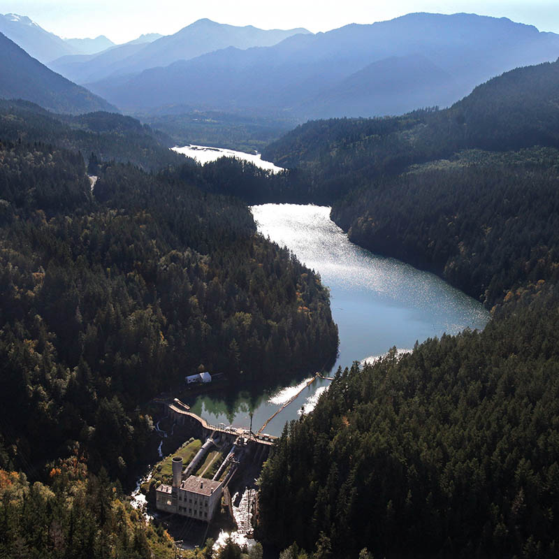
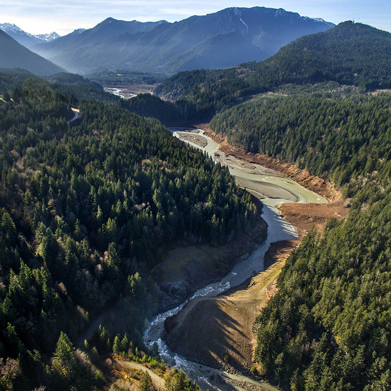

ELWHA RIVER — The Elwha watershed is booming with new life, after the world's largest dam removal.

The first concrete went flying in September 2011, and Elwha Dam was out the following March. Glines Canyon Dam upriver tumbled for good in September 2014. Today the river roars through the tight rock canyon once plugged by Elwha Dam, and surges past the bald, rocky hill where the powerhouse stood. The hum of the generators is replaced by the river singing in full voice, shrugging off a century of confinement like it never happened. Nature's resurgence is visible everywhere. 

"Big things can happen if people persevere," said Mike McHenry, biologist with the Lower Elwha Klallam Tribe, which got the ball rolling on dam removal when it was still thought a crazy idea. "Back in 1990, you ask somebody in Anywhere, USA, about dam removal," McHenry said, "they would have told you that you were nuts."

Not anymore. Washington, still one of the most hydropower-rich states in the nation, is also today the world's dam-busting pioneer.

  

    <h3>Meet the reporter</h3>
    

      Join reporter Lynda V. Mapes for a discussion about the Elwha dam removal, hosted by the Seward Park Audubon Center.
    

      <b>When</b>: 6-7:30 p.m. March 8 at the Royal Room, 5000 Rainier Ave. S.
    

      <b>Admission:</b> free but tickets are required.
    

      <a href="http://m.bpt.me/event/1376853">More information &raquo;</a>
  

PacifiCorp did the math on keeping the Condit Dam on the White Salmon River in Southwestern Washington and blew it up with one blast on Oct. 28, 2011.

It took an act of Congress in 1992 to finally free the Elwha, taking down the pair of dams that had blocked the 45-mile mountain river for a century.

The big idea in all three cases was to get rid of hydropower dams no longer worth their maintenance and repair. The dams also had no fish passage, as required by modern environmental laws. Dam removal is restoring 70 miles of spawning habitat in the Elwha.

The $325 million Elwha experiment remains the biggest dam removal project ever. With 83 percent of the Elwha watershed permanently protected in Olympic National Park, it offered a unique chance to start over.

It's as if the whole watershed was waiting.

<aside class="slider-container" id="slider">
  <image-slider>
    
    
  </image-slider>
  

    A view of the lower Elwha River dam site, 2010 on the left and 2016 on the right. Drag the slider to switch between the images.
  

</aside>

Scientists are amazed at the speed of change under way in the Elwha.

Elk stroll where there used to be reservoirs. Bigger, fatter birds are bearing more young, and moving in to stay. A young forest grows where there was blowing sand in the former reservoir lakebeds. Seeds tumble down the river’s coursing current. The big pulse of sediment trapped behind the dams is passed; the river has regained its luminous teal green color, and its channel is stabilizing. 

  <h2>Read more from Lynda V. Mapes</h2>
  <ul class="jump-links">
    <li><a href="http://old.seattletimes.com/flatpages/specialreports/elwha/?prmid=4749">Elwha: the grand experiment to tear down two dams (2011)</a>
    <li><a href="http://o.seattletimes.com/html/localnews/2024327922_elwharestorationxml.html">Back to nature: last chunk of Elwha dams out in September (2014)</a>
    <li><a href="http://www.mountaineersbooks.org/Elwha-P1107.aspx">Elwha: A River Reborn</a>
    <li><a href="http://www.seattletimes.com/tag/elwha">All Seattle Times Elwha coverage</a>
  </ul>

Logs are tumbling and stacking in the river, building complex, braided channels, islands and jams.

And fish are booming back: More than 4,000 chinook spawners were counted above the former Elwha Dam the first season after it came down. Overall, fish populations are the highest in 30 years. And that’s before the first progeny of salmon and steelhead going to sea since dam removal come back this year. 

